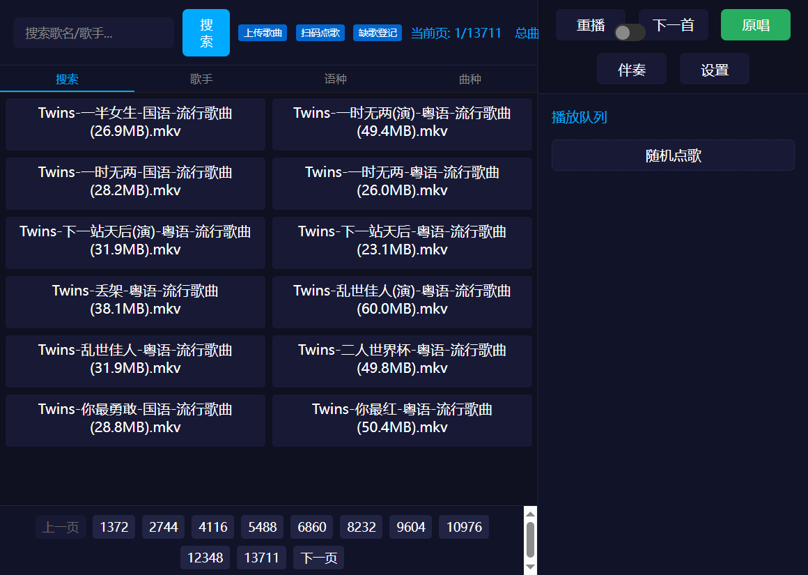
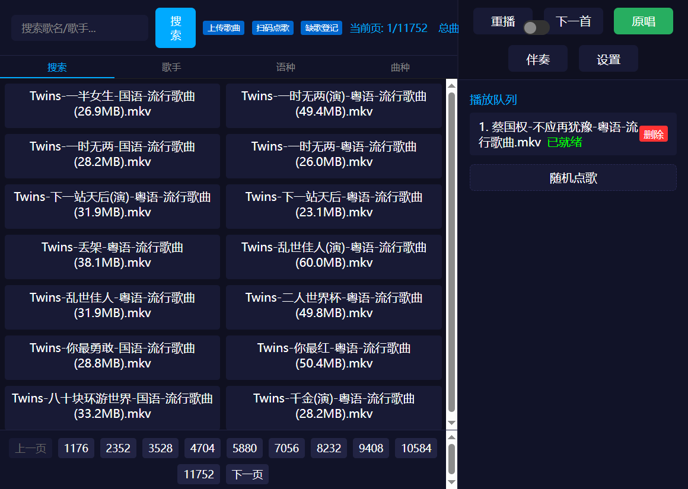
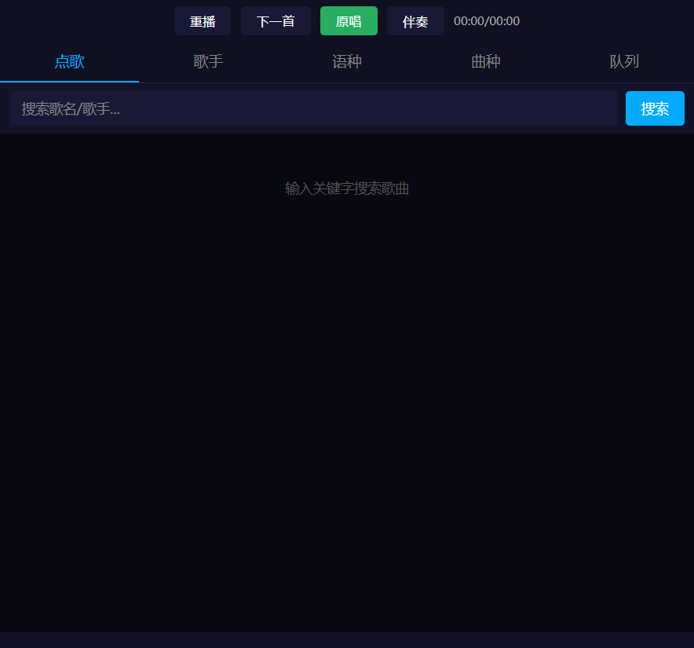

# Web KTV Server

一个轻量级的局域网 KTV 双屏点歌系统。10MB 的程序，让整个局域网变成 KTV。

## 特性

### 点歌方式
- 关键词搜索，16 万首曲库 10 毫秒出结果
- 歌名+歌手组合搜索，拼音首字母搜索
- 歌手分类浏览，按首字母快速定位
- 语种分类（国语/粤语/英语/日语/韩语...）
- 曲种分类（流行歌曲/经典老歌/摇滚/民谣...）
- 随机点歌，同名歌曲自动标注文件大小

### 播放
- 视频/音频自动识别，原唱/伴奏一键切换
- 内嵌歌词实时滚动
- 音频可视化：歌词/波形/频谱条/频谱曲线 四种模式
- 曲库文件异常自动检测（无画面/无声音文件红色标注）

### 手机遥控
- 扫码即用，无需安装 APP
- 搜索、点歌、切歌全支持
- 可设密码，多人同时扫码队列共享

### 省流模式
- 一键开启，视频实时转码低码率传输
- GPU 全流水线加速（解码+编码都在 GPU），1-2 秒出画面
- 动态流控，只缓冲 15 秒，切歌不浪费带宽

### 系统自检
- 启动时自动检测 FFmpeg、FFprobe、GPU 加速、曲库目录
- 打开页面即显示系统状态总览，异常红色标注附解决方案

### 其他
- 网页拖拽上传歌曲，上传后自动增量扫描
- 曲库缓存，二次启动秒级加载
- 缺歌登记，自动记录搜不到的关键词
- 支持 HEVC/H.265 自动转码
- NVIDIA/AMD/Intel GPU 自动检测
- 32 位和 64 位双版本，兼容 Win7 SP1 ~ Win11

## 配套工具

- [ktv-accompaniment-tool](https://github.com/ehfeo/ktv-accompaniment-tool)：基于 UVR-MDX-NET-Inst_HQ_3 模型的本地伴奏分离便携工具。
  - 从歌曲（音频/视频）提取**伴奏（inst）**与**人声（voc）**
  - 给没有伴奏音轨的视频**添加伴奏音轨**或**替换原音轨**
  - 纯本地 CPU 推理、网页操作、无需安装依赖
  - 适合为 KTV 曲库批量准备"原唱/伴奏"双音轨视频

## 截图

<table>
<tr>
<td></td>
<td></td>
</tr>
<tr>
<td></td>
<td></td>
</tr>
</table>

## 快速开始

### 1. 下载

从 [Releases](https://github.com/ehfeo/Web-ktv-server/releases) 下载最新版本。

### 2. 准备 FFmpeg

下载 [ffmpeg.exe](https://www.gyan.dev/ffmpeg/builds/) 和 [ffprobe.exe](https://www.gyan.dev/ffmpeg/builds/)，放到程序同目录。

> 需要 GPU 加速转码请使用完整版 FFmpeg（含 NVENC/QSV/AMF 支持）。

### 3. 运行

```
双击 ktv-server.exe（64 位）或 ktv-server-32.exe（32 位）
```

### 4. 使用

1. 在菜单中填入歌曲目录（支持多个盘符）
2. 浏览器打开显示的地址 → 点歌界面
3. 手机扫页面上的二维码 → 遥控器

## 系统要求

- **服务端**：Windows 7 SP1 及以上，32 位或 64 位
- **客户端**：任意现代浏览器（Chrome / Edge / Firefox / Safari）
- **网络**：局域网（服务端和客户端在同一网段）
- **依赖**：ffmpeg.exe + ffprobe.exe（放程序同目录）

## 编译

需要 Go 1.20.14（确保 Win7 SP1 兼容性）：

```powershell
# 一键编译 32 位和 64 位版本
.\build.ps1
```

编译产物输出到 `build/` 目录。

## 技术栈

- Go 语言编写，单文件部署，前端全部内嵌
- Fragmented MP4 实时流媒体，FFmpeg 管道输出
- GPU 全流水线加速（CUDA 解码 + NVENC 编码），无 GPU 自动回退 CPU
- Web Audio API 实时可视化，预分配缓冲零 GC
- QR 中继服务器架构，支持跨网段扫码点歌
- 曲库缓存 + 增量扫描 + 预计算搜索索引

## License

MIT
